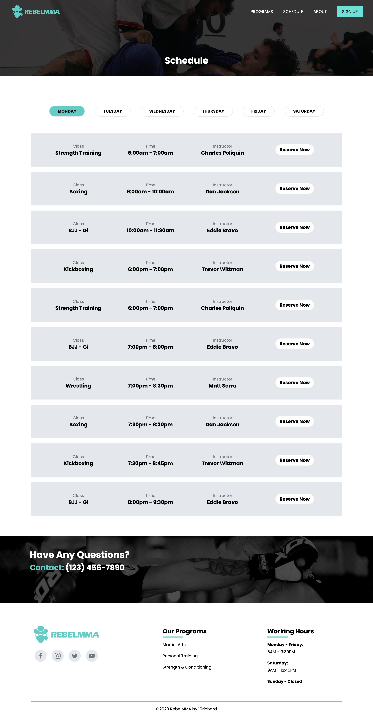
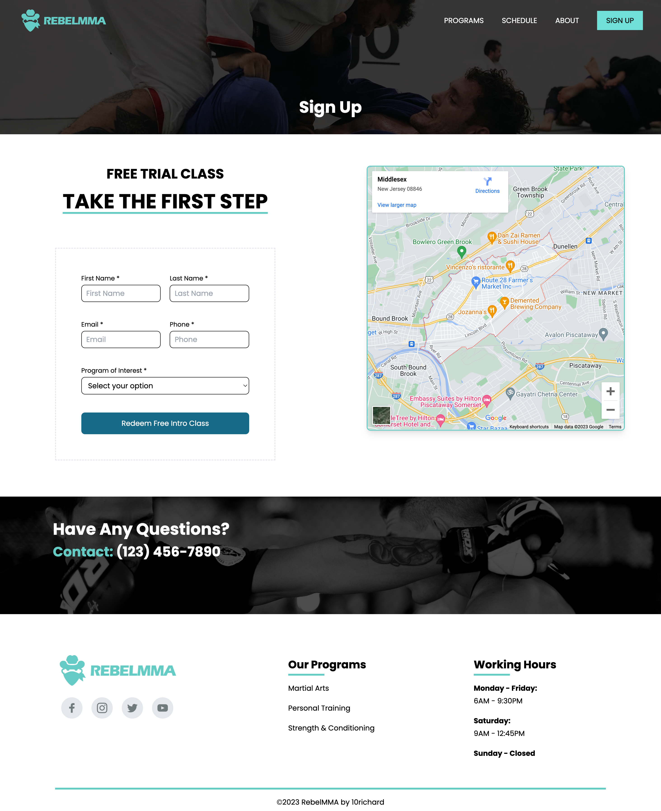

# RebelMMA

# <h3>About</h3>

A multipage website for an MMA academy designed to
welcome and engage users interested in learning
about various martial arts or bettering their health
in general

Got inspiration for website design from StrategicMMA
and Gymate (s/o Stefan)

# <h3>Built with:</h3>

∙ React w/ Typescript

∙ Tailwind

# Screenshots of the Project

# <h3>Home Page</h3>

    

# <h3>Programs Page</h3>

    

# <h3>Schedule Page</h3>

    

# <h3>About Page</h3>

    

# <h3>Sign Up Page</h3>

    

